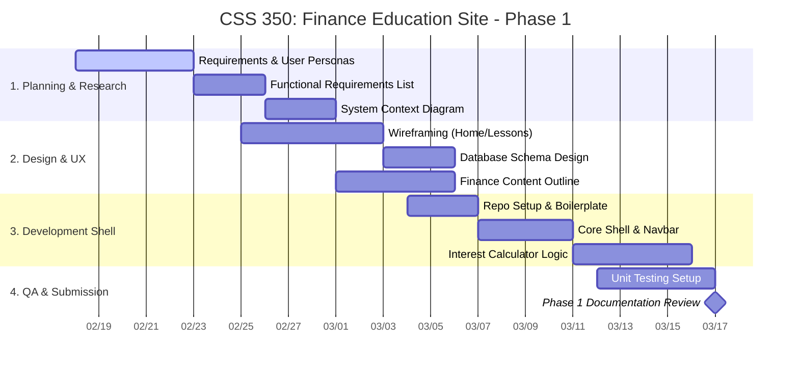

# *App Name* Project Charter

<!-- 

STATEMENT OF WORK

AUTHORED BY: JACOB ARQUIZA

-->

## Statement of Work

### Product Description
**App name** is a web-based application that helps young, first-time investors learn how to manage their money through interactive lessons. 

Through lessons on financial literacy geared towards those without prior financial knowledge, quizzes and assessments, and real-world scenario training, users of **app name** will be able to learn the basics of money management step-by-step.

> #### Key Feature List:
> - **Interactive curriculum** on money management
> - **Validation** of retained knowledge through quizzes and  assignments
> - **Application** of knowledge to simulated real-world scenarios

### Estimated Cost
The total estimated budget for the first year of operation is $108,000, which remains within the defined hard budget constraints of the project. The costs are divided into capital expenses and operational requirements

#### Cost Preview
| Category | Amount | 
| :--- | :--- | 
| Total Startup / Capital Expenses (CapEx) | $60,000 | 
| Total Annual Operating Expenses (OpEx) | $48,000 | 
| **Year 1 Total Budget** | **$108,000** | 

### Estimated Launch Date

### Availability Estimated

**Minimum Viable Product (MVP)**
Public-facing web application. It wil display in English, so although other countries may be able to access the site at this stage they may not be able to understand it.

Available to any English-speaking individual with a computer and internet access.

**Past the MVP+**
Past the MVP, **app name** will have mobile support through iOS and Android apps and have multilingual support. 

Available for anyone with an iOS or Andriod device in linguistically supported countries.

### Monetization Strategy

The monitization strategy for **app name** is comprised of two key parts: Advertisements and Premium Suscriptions.
> #### **1.** Advertisements  
> Advertisements would be run along the bottom of the page at all times. Ad revenue would contribute to our monetization strategy. 

> #### **2.** Premium Month-to-Month Subscription
> The monthly subscription would unlock:
> -  Scenario assessments based on real-world events. 
> -  AI insight to answers they got incorrect.  
>
> Subscription fees would be priced at **$x/mo**.

<!-- 

SCHEDULE

AUTHORED BY: AAYAM BAIDYA

-->

</bn>

# Scheduling

<!-- 

BUDGET

AUTHORED BY: SAIF ALHASAN SAHIB

-->

</bn>

## High-Level Project Budget Spreadsheet 
**[Source Excel Sheet](./Budget%20CSS350.xlsx)**

#### Project:
> **APP NAME**  

#### Audience:
> Young, First-Time Investors  

#### Budget Level:   
> High-Level Financial Baseline Estimate  

| WBS ID | WBS Category                 | Cost Type | Description                                   | One-Time Cost (CapEx) | Monthly Cost (OpEx) | Annual Cost (OpEx) |
|--------|------------------------------|-----------|-----------------------------------------------|-----------------------|---------------------|--------------------|
| 1      | Product Development          | CapEx     | Core web app development (frontend & backend) | $35,000               | —                   | —                  |
| 2      | Design & UX                  | CapEx     | UI/UX research, prototyping, accessibility    | $8,000                | —                   | —                  |
| 3      | Content Creation             | CapEx     | Initial educational content (videos, lessons) | $12,000               | —                   | —                  |
| 4      | Infrastructure Setup         | CapEx     | Cloud setup, security, deployment             | $5,000                | —                   | —                  |
| 5      | Hosting & Cloud Services     | OpEx      | Servers, storage, bandwidth                   | —                     | $600                | $7,200             |
| 6      | Maintenance & Updates        | OpEx      | Bug fixes, feature enhancements               | —                     | $1,200              | $14,400            |
| 7      | Content Updates & Moderation | OpEx      | Ongoing educational updates                   | —                     | $800                | $9,600             |
| 8      | Support & Administration     | OpEx      | User support, admin tasks                     | —                     | $500                | $6,000             |
| 9      | Marketing & Outreach         | OpEx      | User acquisition & branding                   | —                     | $900                | $10,800            |

### Budget Totals
| Category | Amount | 
| :--- | :--- | 
| Total Startup / Capital Expenses (CapEx) | $60,000 | 
| Total Annual Operating Expenses (OpEx) | $48,000 | 
| **Year 1 Total Budget** | **$108,000** | 

### Hard Budget Constraints
| Constraint Type | Limit |
| :--- | :--- |
| Maximum CapEx | $65,000 |
| Maximum Annual OpEx | $50,000 |
| Infrastructure Strategy | Cloud-based, scalable |
| Cost Control Measure | Open-source tools where possible |

<!-- 

MARKET AND CUSTOMER ANALYSIS

AUTHORED BY: PETER WONG

-->

</bn>

<!-- 

RISK ANALYSIS AND MANAGEMENT

AUTHORED BY: EMILY KIM

-->

 

## Risk Analysis and Management

This section outlines the major risks that could affect the successful completion of the financial education web application. It identifies threats related to schedule, budget, technical implementation, and compliance. It also includes assumptions, constraints, and mitigation strategies. The app is intended to be a free educational resource, with potential optional monetization features (ads or premium content) considered in the future.

### 1. Identification of Major Risks

#### Technical Risks
- **Scalability limitations:** Increased user traffic could degrade performance if backend services are not designed to scale.
- **Third-party service dependency:** Reliance on hosting and database services may cause downtime or unexpected failures.
- **Security vulnerabilities:** Weak authentication or encryption could expose user accounts or user-generated data.

#### Schedule Risks
- **Underestimated development effort:** Implementing core features such as login/signup, lessons, quizzes, vocab lists, analytics dashboards, and user profiles may take longer than anticipated.
- **Limited team availability:** Academic schedules or personal commitments may delay development milestones.

#### Budget Risks
- **Unexpected hosting or service costs:** Even free-tier hosting can incur costs if usage grows or resource limits are exceeded.
- **Optional monetization services:** Future implementation of ads or premium content may require additional setup or resources.

#### User Adoption Risks
- **Low engagement and retention:** Users may not consistently use the app if content is not engaging, lessons are too complex, or quizzes are not intuitive.
- **Target audience mismatch:** Content may not align with users’ financial literacy levels or learning goals.

#### Legal and Compliance Risks
- **Financial advice misinterpretation:** Users may interpret educational content as professional financial advice.
- **Data privacy issues:** Any stored user data (login info, progress tracking) must comply with privacy best practices and regulations.

### 2. Assumptions and Constraints

#### Assumptions
- Users will have access to reliable internet and modern web browsers.
- All content is strictly educational and not professional financial advice.
- Free-tier hosting and services will remain available and reliable.

#### Constraints
- Fixed development timeline: work begins February 18th.
- Limited team size and hours; all features must be prioritized realistically.
- Budget primarily limited to hosting and essential infrastructure costs. It must stay free.
- Development must focus on core functionality first (login/signup, lessons, quizzes, vocab list, analytics, profile).

### 3. Risk Reduction and Action Plan

#### Risk Reduction Strategies
- Implement secure authentication and encryption to protect user data.
- Break development into realistic milestones for each core feature, with buffer time for delays.
- Prioritize core educational features first.
- Optional features can be added after launch.
- Conduct usability testing to ensure lessons, quizzes, vocab lists, and analytics dashboards are effective and intuitive.
- Clearly display disclaimers stating the app provides educational content only.

#### Action Plan if Risks Are Realized
- Reduce scope by focusing on essential features if schedule or hosting limits are exceeded.
- Temporarily disable non-critical features to maintain project timeline.
- Iterate content or dashboards based on user feedback if engagement is low.
- Adjust privacy policies or disclaimers if compliance concerns arise.
